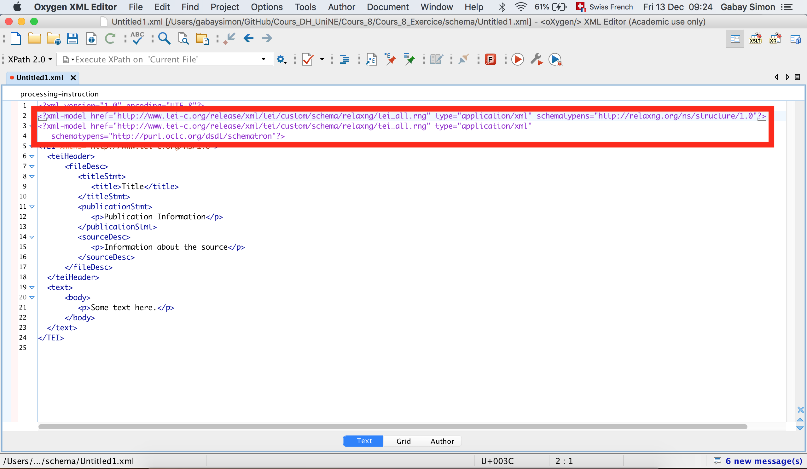
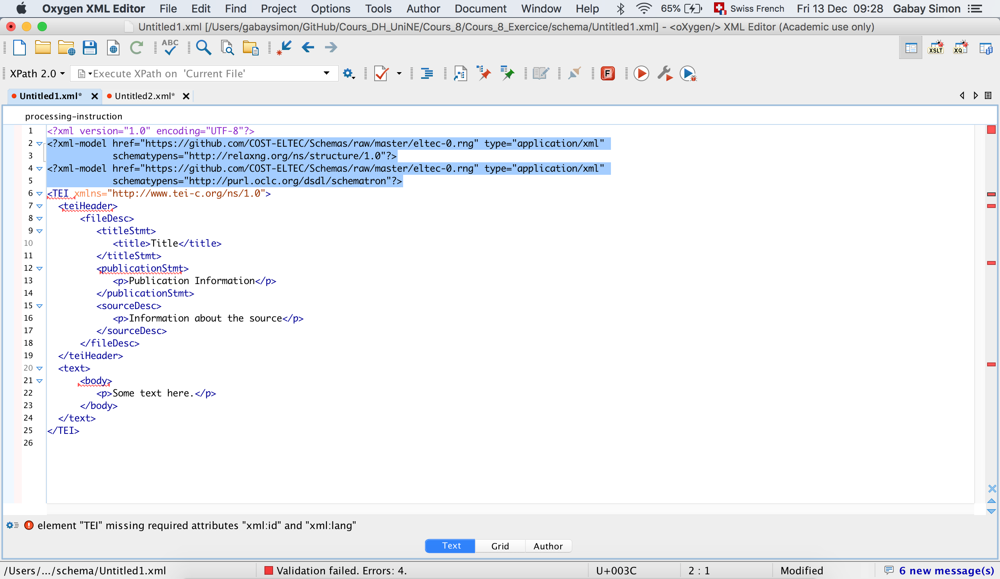

PDEN 2019

# Corpus encoding

Simon Gabay

12 décembre 2019

---

Before starting, remember that you can find examples here:

* [French ELTeC corpus](https://zenodo.org/record/3528337)
* [German ELTeC corpus](https://zenodo.org/record/3543244)
* [Italian ELTeC corpus](https://zenodo.org/record/3543333)

---
# ELTeC: Metadata
---

Open a new document


---

Search for "TEI all"


---

We now need to adapt the schema



---
We need to replace lines 2 and 3
```xml
<?xml-model href="http://www.tei-c.org/release/xml/tei/custom/schema/relaxng/tei_all.rng" type="application/xml" schematypens="http://relaxng.org/ns/structure/1.0"?>
<?xml-model href="http://www.tei-c.org/release/xml/tei/custom/schema/relaxng/tei_all.rng" type="application/xml"
  schematypens="http://purl.oclc.org/dsdl/schematron"?>
```
by the following ones:

```xml
<?xml-model href="https://github.com/COST-ELTEC/Schemas/raw/master/eltec-0.rng" type="application/xml"
            schematypens="http://relaxng.org/ns/structure/1.0"?>
<?xml-model href="https://github.com/COST-ELTEC/Schemas/raw/master/eltec-0.rng" type="application/xml"
            schematypens="http://purl.oclc.org/dsdl/schematron"?>
```

---

There is a problem!


---
## TEI

ELTeC is a subset of the TEI. It uses less elements, but it is more strict: it requires some information, that is not compulsory in TEI all.

For instance, we need to add two attributes on the ```<TEI>``` element:
* ```@xml:id``` which provides a unique identifier for the text. It has to start with a letter
* ```xml:lan``` which indicates what is the language of the text, using a standard code (```fra```, ```deu```, ```ita```…)
---

## ```<extent>```

After ```<titleStmt>``` we need to add:

```xml
<extent>
    <measure unit=""></measure>
</extent>
```

Possible values for ```@unit``` are: ```words```, ```vols``` or ```pages```

But it is not enough

---

## ```<encodingDesc>```

After ```</fileDesc>``` we need to add:

```xml
<encodingDesc n="">
    <p></p>
</encodingDesc>
```
Possible values for ```@n``` are: ```eltec-0```, ```eltec-1```, ```eltec-2```

---
## ```<profileDesc>```

After ```</encodingDesc>``` we need to add:


```xml
<profileDesc>
    <langUsage>
      <language ident=""/>
    </langUsage>
    <textDesc>
        <authorGender xmlns="http://distantreading.net/eltec/ns" key=""></authorGender>
        <size xmlns="http://distantreading.net/eltec/ns" key=""></size>
        <canonicity xmlns="http://distantreading.net/eltec/ns" key=""></canonicity>
        <timeSlot xmlns="http://distantreading.net/eltec/ns" key=""></timeSlot>
    </textDesc>
</profileDesc>
```
Possible values for ```@ident``` are languages ISO codes (```fr```, ```de```, ```it```)

Possible values for ```@key``` are:
* For ```<authorGender>```: ```F```, ```M```, ```U```, ```X```
* For ```<size>```: ```long```, ```medium```, ```short```
* For ```<canonicity>```: ```high```, ```low```, ```unspecified```
* For ```<timeSlot>```: ```T1```, ```T2```, ```T3```, ```T4```

---
### ```<revisionDesc>```

After ```</profileDesc>``` we need to add:


```xml
<revisionDesc>
    <change when=""></change>
</revisionDesc>
```
---
Here is the skeleton of a ELTeC document:
```xml
<?xml version="1.0" encoding="UTF-8"?>
<?xml-model href="https://github.com/COST-ELTEC/Schemas/raw/master/eltec-0.rng" type="application/xml"
            schematypens="http://relaxng.org/ns/structure/1.0"?>
<?xml-model href="https://github.com/COST-ELTEC/Schemas/raw/master/eltec-0.rng" type="application/xml"
            schematypens="http://purl.oclc.org/dsdl/schematron"?>
<TEI xmlns="http://www.tei-c.org/ns/1.0" xml:id="LETTER0000000" xml:lang="ISO">
  <teiHeader>
      <fileDesc>
         <titleStmt>
            <title>Title</title>
         </titleStmt>
         <extent>
            <measure unit="">NUMBER</measure>
         </extent>
         <publicationStmt>
            <p>Publication Information</p>
         </publicationStmt>
         <sourceDesc>
            <p>Information about the source</p>
         </sourceDesc>
      </fileDesc>
     <encodingDesc n="">
        <p></p>
     </encodingDesc>
     <profileDesc>
        <langUsage>
           <language ident=""/>
        </langUsage>
        <textDesc>
           <authorGender xmlns="http://distantreading.net/eltec/ns" key=""></authorGender>
           <size xmlns="http://distantreading.net/eltec/ns" key=""></size>
           <canonicity xmlns="http://distantreading.net/eltec/ns" key=""></canonicity>
           <timeSlot xmlns="http://distantreading.net/eltec/ns" key=""></timeSlot>
        </textDesc>
     </profileDesc>
     <revisionDesc>
        <change when=""></change>
     </revisionDesc>
  </teiHeader>
  <text>
      <body>
         <p>Some text here.</p>
      </body>
  </text>
</TEI>
```

---
# ELTeC: Transcription Guidelines
---
## The objective
We need to capture a minimum of features for each text:
* significant structural features (chapters, headings, paragraphs...)
* descriptive metadata (bibliographic and non bibliographic)

Considering the amount of text that will be encoded, we cannot offer the finest granularity: we need to choose elements in the TEI (c. 30 out of 450)

Obviously such a project raises many questions as to which features should be captured.

---
## What is essential?

* Are we interested in the physical structure ? (book, page, line…)
* Are we interested in the logical structure ? (parts, chapters, paragraphs…)
* Both?
* Do we want to capture polyphonic effects (direct and indirect speech……)
---
## Basic elements: structure

* ```<pb>``` when a page begins
* ```<front>``` for liminal material (preface, forword…)
* ```<div>``` for major structural divisions (parts, sections, chapters etc.)
* ```<div>``` can have a ```@type``` to indicate the function of a structural division with the following values: ```liminal```, ```titlepage```, ```notes```, ```part```, ```chapter```
---
## Basic elements 2: the text
* ```<head>``` for the title of a chapter, or of any other subdivision
* ```<p>``` element is used for everything which is typeset as a separate block on the page, including both paragraphs and list items
* ```<l>``` element is used for verse lines or similar, typically set off from the rest of the text
* ```<hi>``` indicates the presence of typographic salience (superscript, italics…)
---
## Reference scheme
* text identifier : every text will have an identifier consisting of its three letter language code in upper case and a five digit serial number, for example ```FRA00042```
* chapter identifier: each chapter or equivalent will have an identifier concatenating the text identifier and a three digit serial number, for example ```FR042012``` is the twelfth chapter of the 42nd French novel.
* If sub-chapter segmentation is implemented, then the segments will append a further four digit serial number.
* The identifier will be supplied as the value of an xml:id attribute on each ```<text>```, ```<div>```, ```<front>```, ```<back>```, or ```<s>``` element as appropriate.

---
## Additional remarks
We do not preserve the lineation of running prose in our source texts, since this is always purely an artefact of the source edition. For the same reason we reassemble words broken across a line break, silently removing any hyphen present.

